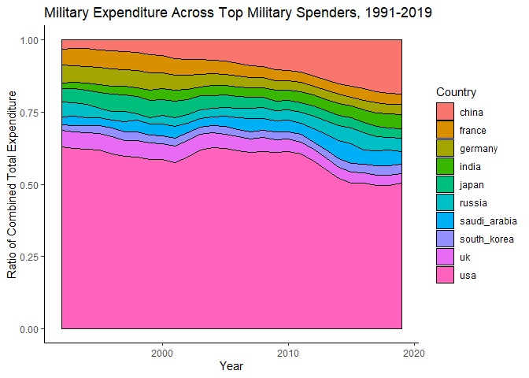

Data Exploration
================
Gio Nikolaishvili
</br>17 January 2021

### The Data

Load the raw data.

``` r
# Import dataset
data <- read_csv("https://raw.githubusercontent.com/gnikolaiuoregon/military_cycles/main/real_military_spending_cleaned.csv?token=ASLTQLXG4CKJDXPMTHSTPA3ABNBFW")

# Store the dataset as a dataframe
data <- as.data.frame(data)

# Restrict data to post-1988
data <- data %>% filter(year > 1987)
```

Check the set of top-10 military spenders for the years 2019, 2010, and
2000.

``` r
# Order data by military expenditure
data2019 <- data %>% filter(year == 2019)

# Create new crossectional dataset of expenditure by country for 2019
names <- names(data2019)
names <- names[c(2:length(names))]
country <- names
mil_exp <- c(1:length(names))
for(i in 1:length(names)) {
  mil_exp[i] <- data2019[1,i+1]
}
data2019 <- data.frame(country, mil_exp)

# Arrange new dataset by military expenditure (descending order)
data2019 <- data2019 %>% arrange(desc(mil_exp))

# Keep top-10 spenders
topspend2019 <- data2019[c(1:10),]

# Plot top-10 military expenditure timeplot
ggplot(topspend2019, aes(x=country, y=mil_exp, fill=country)) +
  geom_col() +
  theme_classic() +
  labs(x = "Country", y= "Military Spending ($M)") +
  scale_y_continuous(name="Military Spending ($M)", limits=c(0, 1000000)) +
  theme(axis.text.x = element_blank(), axis.ticks.x = element_blank()) +
  ggtitle("Top Military Spenders of 2019")
```

<!-- -->

``` r
# Save the names of top-10 spenders of 2019
top10spend_2019 <- topspend2019$country
top10spend_2019 <- as.vector(top10spend_2019[c(1:10)])

###
###
###
# Repeat the same code as in previous chunk but for 2010
###
###
###

# Order data by military expenditure
data2010 <- data %>% filter(year == 2010)

# Create new crossectional dataset of expenditure by country for 2019
names <- names(data2010)
names <- names[c(2:length(names))]
country <- names
mil_exp <- c(1:length(names))
for(i in 1:length(names)) {
  mil_exp[i] <- data2010[1,i+1]
}
data2010 <- data.frame(country, mil_exp)

# Arrange new dataset by military expenditure (descending order)
data2010 <- data2010 %>% arrange(desc(mil_exp))

# Keep top-10 spenders
topspend2010 <- data2010[c(1:10),]

# Plot top-10 military expenditure timeplot
ggplot(topspend2010, aes(x=country, y=mil_exp, fill=country)) +
  geom_col() +
  theme_classic() +
  labs(x = "Country", y= "Military Spending ($M)") +
  scale_y_continuous(name="Military Spending ($M)", limits=c(0, 1000000)) +
  theme(axis.text.x = element_blank(), axis.ticks.x = element_blank()) +
  ggtitle("Top Military Spenders of 2010")
```

<!-- -->

``` r
###
###
###
# Repeat the same code as in previous chunk but for 2000
###
###
###

# Order data by military expenditure
data2000 <- data %>% filter(year == 2000)

# Create new crossectional dataset of expenditure by country for 2019
names <- names(data2000)
names <- names[c(2:length(names))]
country <- names
mil_exp <- c(1:length(names))
for(i in 1:length(names)) {
  mil_exp[i] <- data2000[1,i+1]
}
data2000 <- data.frame(country, mil_exp)

# Arrange new dataset by military expenditure (descending order)
data2000 <- data2000 %>% arrange(desc(mil_exp))

# Keep top-10 spenders
topspend2000 <- data2000[c(1:10),]

# Plot top-10 military expenditure timeplot
ggplot(topspend2000, aes(x=country, y=mil_exp, fill=country)) +
  geom_col() +
  theme_classic() +
  labs(x = "Country", y= "Military Spending ($M)") +
  scale_y_continuous(name="Military Spending ($M)", limits=c(0, 1000000)) +
  theme(axis.text.x = element_blank(), axis.ticks.x = element_blank()) +
  ggtitle("Top Military Spenders of 2000")
```

<!-- -->

Take the top-10 2019 spenders (usa, china, india, russia, saudi\_arabia,
france, germany, uk, japan, south\_korea) and create various types of
plots of their military expenditure over the period of 1992-2019.

``` r
# Filter for the top-10 2019 spenders from the original dataset
data_topspenders <- data[,top10spend_2019]
year <- c(1988:2019)
data_topspenders <- mutate(data_topspenders, year)

# Gather 1992 data in single dataframe 
topspendtemp <- data_topspenders %>% filter( year == 1988) 
topspendtemp <- as.vector(topspendtemp)
names(topspendtemp) <- NULL
expenditure <- topspendtemp[c(1:10)]
expenditure <- matrix(expenditure, ncol=1, byrow=TRUE)
year <- c(1:10)
for (i in c(1:10)){
  year[i] = 1988
}
topspendtemp <- data.frame(expenditure, top10spend_2019, year)
topspenders <- topspendtemp 

# Iterate over all other years to gather into dataframe
for (t in c(1989:2019)){
  
  topspendtemp <- data_topspenders %>% filter( year == t) 
  topspendtemp <- as.vector(topspendtemp)
  names(topspendtemp) <- NULL
  expenditure <- topspendtemp[c(1:10)]
  expenditure <- matrix(expenditure, ncol=1, byrow=TRUE)
  year <- c(1:10)
  for (i in c(1:10)){
    year[i] = t
  }
  topspendtemp <- data.frame(expenditure, top10spend_2019, year)
  topspenders <- rbind(topspenders, topspendtemp) 
  
}

# Convert all numeric topspenders variables to double
topspenders$year <- as.double(topspenders$year)
topspenders$expenditure <- as.double(topspenders$expenditure)

# Filter topspenders datasets for year > 1991
topspenders9119 <- topspenders %>% filter(year > 1991)

# Make sure all numeric topspenders9119 variables are doubles as well
topspenders9119$year <- as.double(topspenders9119$year)
topspenders9119$expenditure <- as.double(topspenders9119$expenditure)

###
###
###
# Plot top spenders' expenditure 1991-2019
###
###
###

# Military expenditure ratio timeplot
ggplot(topspenders9119, aes(x= year, y = expenditure, fill=top10spend_2019)) +
  geom_area(position = "fill") +
  geom_area( position = 'fill', colour="black") +
  theme_classic() +
  labs(x = "Year", y = "Ratio of Combined Total Expenditure") +
  ggtitle("Military Expenditure Across Top Military Spenders, 1991-2019") +
  guides(fill=guide_legend(title="Country"))
```

<!-- -->

``` r
# Stacked military expenditure timeplot
ggplot(topspenders9119, aes(x= year, y = expenditure, fill=top10spend_2019)) +
  geom_area( position = 'stack') +
  geom_area( position = 'stack', colour="black") +
  theme_classic() +
  labs(x = "Year", y = "Combined Total Expenditure ($M)") +
  ggtitle("Military Expenditure Across Top Military Spenders, 1991-2019") +
  guides(fill=guide_legend(title="Country")) 
```

<!-- -->

``` r
# Create country-specific datasets for later use
chinaspend_df <- topspenders9119 %>% filter(top10spend_2019 == "china")
francespend_df <- topspenders9119 %>% filter(top10spend_2019 == "france")
germanyspend_df <- topspenders9119 %>% filter(top10spend_2019 == "germany")
indiaspend_df <- topspenders9119 %>% filter(top10spend_2019 == "india")
japanspend_df <- topspenders9119 %>% filter(top10spend_2019 == "japan")
russiaspend_df <- topspenders9119 %>% filter(top10spend_2019 == "russia")
saudi_arabiaspend_df <- topspenders9119 %>% filter(top10spend_2019 == "saudi_arabia")
south_koreaspend_df <- topspenders9119 %>% filter(top10spend_2019 == "south_korea")
ukspend_df <- topspenders9119 %>% filter(top10spend_2019 == "uk")
usaspend_df <-topspenders9119 %>% filter(top10spend_2019 == "usa")

# Top 10 dataset w/o US and China
topspenders9119_nousachina <- rbind(francespend_df, germanyspend_df)
topspenders9119_nousachina <- rbind(topspenders9119_nousachina, indiaspend_df)
topspenders9119_nousachina <- rbind(topspenders9119_nousachina, japanspend_df)
topspenders9119_nousachina <- rbind(topspenders9119_nousachina, russiaspend_df)
topspenders9119_nousachina <- rbind(topspenders9119_nousachina, saudi_arabiaspend_df)
topspenders9119_nousachina <- rbind(topspenders9119_nousachina, south_koreaspend_df)
topspenders9119_nousachina <- rbind(topspenders9119_nousachina, ukspend_df)

# Military expenditure timeplot
ggplot(topspenders9119_nousachina, aes(x= year, y = expenditure, color = top10spend_2019, group = top10spend_2019)) +
  geom_line(size=1.5) +
  theme_classic() +
  labs(x = "Year", y = "Total Expenditure ($M)") +
  ggtitle("Military Expenditure of Top Military Spenders (w/o US & China), 1991-2019") +
    scale_color_discrete(name = "Country")
```

<!-- -->

### Preliminary Factor Analysis

Text.
